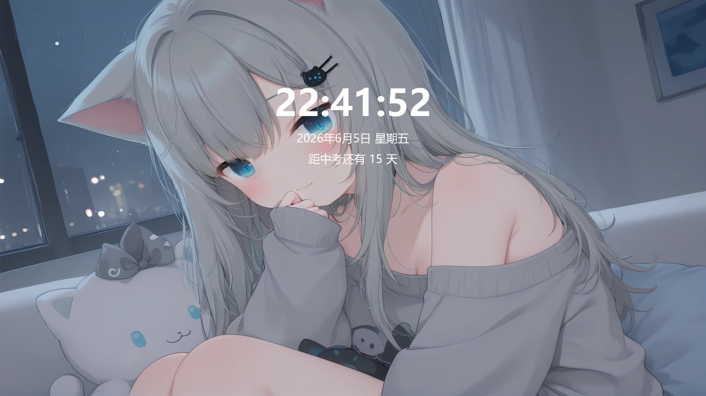
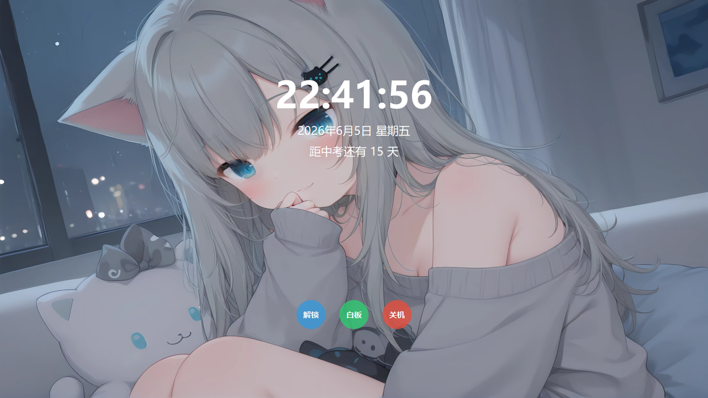

# **Lock Screen for Class**
为班级管理而生的锁屏

##图示

## 📦 项目描述
锁屏从班级教学管理环境中“长”出来，该锁屏目的是服务班级管理而非强制锁屏。因此，非必要情况该锁屏不会提供特别强效的锁屏机制。
功能：
- 可以通过UAC获取uiaccess提权置顶锁屏
- 锁屏窗口包括日期时间中考倒计时
- 提供密码（管理员可扫二维码获取密码）＋u盘解锁
- 到锁定时间可以检查希沃白板/展台是否全屏，全屏不会锁，最小化及退出会立即触发锁屏
- 锁屏可以直接启动希沃白板（配置文件可自定义）
- 锁屏可以更换背景，关机，三个按钮会自动隐藏

## 🚀 使用
1.  UIAccess提权：双击start.bat并授权uac
2. 普通（不提权）：直接打开lockscreenforclass

## ❕重要提示
- 需要第三方py库：pyqt5 ; pywin32 ; psutil ; qrcode
- 黑屏强锁（非图示普通锁定）处于测试阶段
- 清理日志处于测试阶段
- 有许多地方仍未支持配置文件自定义，意味着你需要手动去源代码更改
- 使用start.bat授权uac提权启动；直接双击锁屏文件不提权启动
- 使用start.bat启动，必须将锁屏pyw文件封装exe(pyinstaller --onefile --uac-uiaccess)并放置于start同目录,该exe文件名需为“lockscreenforclass"

## ❗️ 免责声明
本项目仅用于学习交流使用目的, 请勿将本项目用于可能违反当地法律、侵犯著作权等。若将本项目用于非法用途, 一切后果由使用者承担。开发者不承担此类行为带来的任何后果或责任。

## ⚖️ 许可证
本软件基于 GPL-3.0 许可证发布
