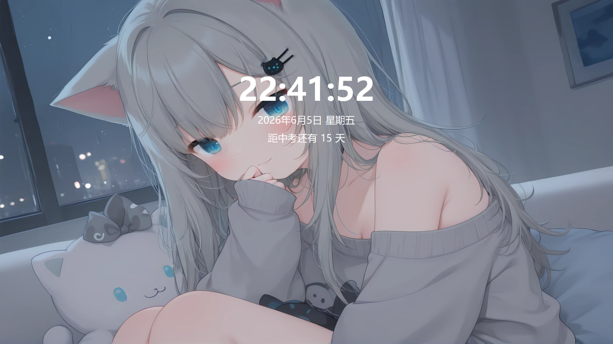
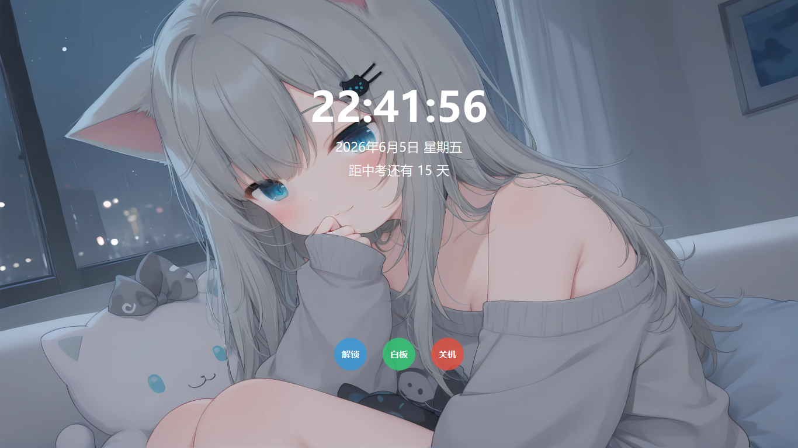

# **Lock Screen for Class**
为班级管理而生的锁屏
v0.6宣传片→https://www.bilibili.com/video/BV1jy7G6kEo3/?share_source=copy_web&vd_source=c9d828a5f589cafde88a1012eb18b02c

##图示

## 📦 项目描述
锁屏从班级教学管理环境中“长”出来，该锁屏目的是服务班级管理而非强制锁屏。因此，非必要情况该锁屏不会提供特别强效的锁屏机制。
功能：
- 可以通过UAC获取uiaccess提权置顶锁屏
- 锁屏窗口包括日期时间中考倒计时
- 提供密码（管理员可扫二维码获取密码）＋u盘解锁
- 到锁定时间可以检查希沃白板/展台是否全屏，全屏不会锁，最小化及退出会立即触发锁屏
- 锁屏可以直接启动希沃白板（配置文件可自定义）
- 锁屏可以更换背景，关机，三个按钮会自动隐藏

## 🚀 使用
1.  UIAccess提权：双击start.bat并授权uac

## 提示
- 目前不适用于有键盘的一体机（没有屏蔽快捷键等）目前只有uiaccess提权
- 如果你授权uac后无法打开，请查看系统是否禁用了ti权限
- 打开设置耗费时间较长，请耐心等待
- 开机自启项在公共的启动文件夹
- 初始密码为114514

## ❕重要提示
- 需要第三方py库：pyqt5 ; pywin32 ; psutil ; qrcode
- 使用start.bat授权uac提权启动
- 使用start.bat启动，必须将锁屏pyw文件封装exe(pyinstaller --onefile --uac-uiaccess)并放置于start同目录,该exe文件名需为“lockscreenforclass"

## ❗️ 免责声明
本项目仅用于学习交流使用目的, 请勿将本项目用于可能违反当地法律、侵犯著作权等。若将本项目用于非法用途, 一切后果由使用者承担。开发者不承担此类行为带来的任何后果或责任。

## ⚖️ 许可证
本软件基于 GPL-3.0 许可证发布
